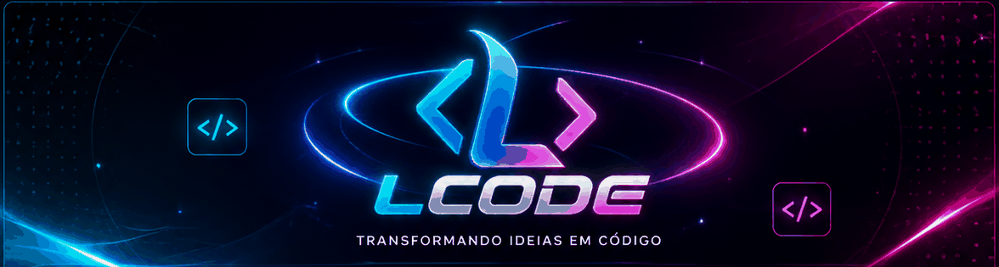
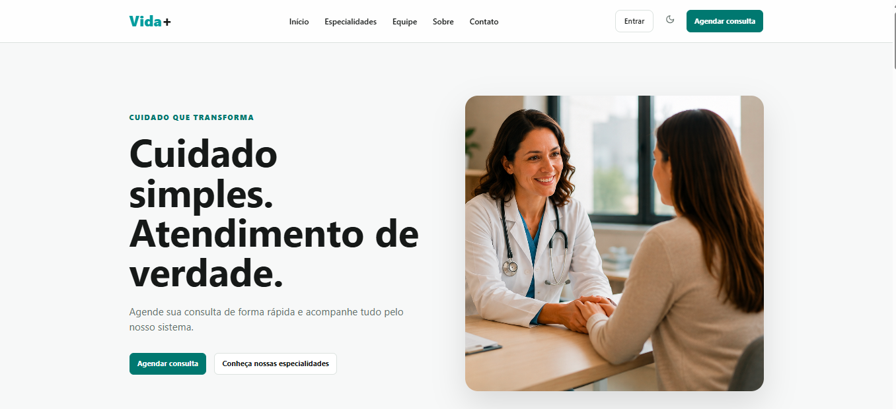
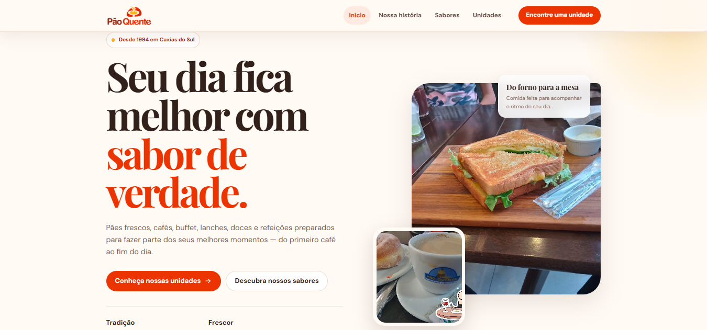
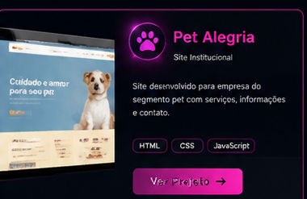
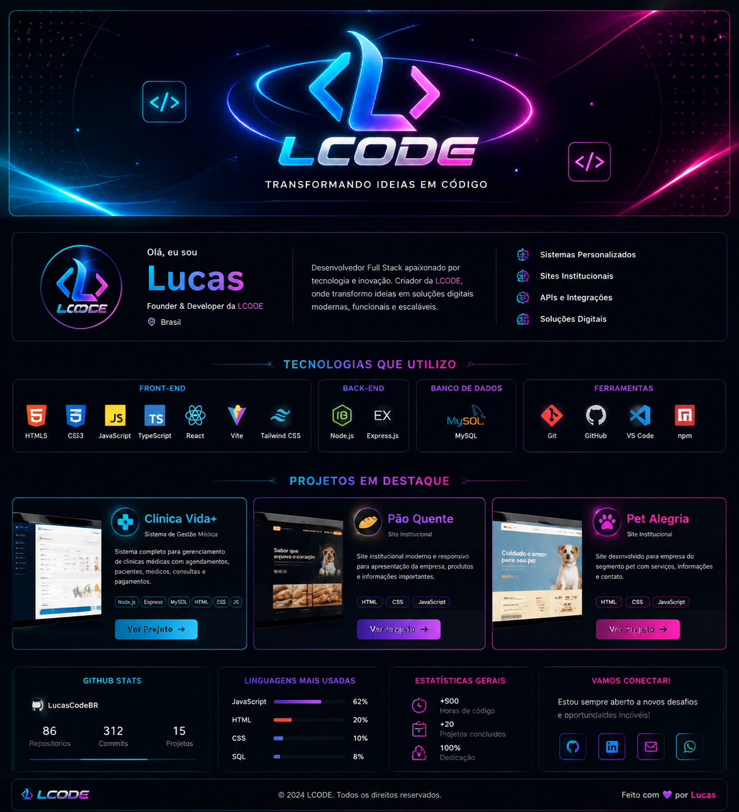
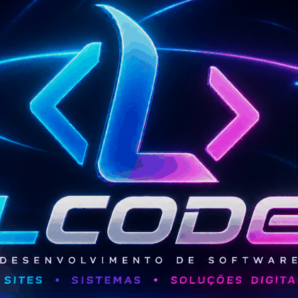

 
 

# Lucas

### Founder & Full Stack Developer at LCODE

**Transformando ideias em código.**

 

---

## 👨‍💻 Sobre mim

Olá! Eu sou **Lucas**, fundador da **LCODE** e desenvolvedor **Full Stack**.

Crio soluções digitais completas, unindo **design**, **programação** e **experiência do usuário** para desenvolver projetos modernos, funcionais e profissionais.

- ⚙️ Sistemas personalizados
- 🌐 Sites institucionais
- 🔌 APIs e integrações
- 🗄️ Aplicações com banco de dados
- 🎨 Interfaces modernas e intuitivas

---

## 🏢 LCODE

A **LCODE** é minha marca de desenvolvimento, focada em criar **sites, sistemas e soluções digitais** com identidade visual forte e experiência profissional.

**Cores da marca:**

`#00C2FF` • `#0066FF` • `#7B2EFF` • `#FF2D95`

---

## 🛠️ Tecnologias que utilizo

### Front-end
`HTML5` • `CSS3` • `JavaScript` • `TypeScript` • `React` • `Vite` • `Tailwind CSS`

### Back-end
`Node.js` • `Express.js` • `APIs REST` • `CRUD` • `Integração Front-end/Back-end`

### Banco de Dados
`MySQL` • `SQL` • `Modelagem de Dados` • `Relacionamentos` • `Consultas`

### Ferramentas
`Git` • `GitHub` • `VS Code` • `npm`

---

## 🚀 Projetos em destaque

<table>
<tr>
<td width="33%" align="center" valign="top">

  
<b>🏥 Clínica Vida+</b>
 
Sistema completo de gestão médica.
  
<b>Tecnologias:</b>
 
<code>HTML</code> <code>CSS</code> <code>JavaScript</code> <code>Node.js</code> <code>Express</code> <code>MySQL</code>
</td>
<td width="33%" align="center" valign="top">

  
<b>🥖 Pão Quente</b>
 
Site institucional moderno e responsivo.
  
<b>Tecnologias:</b>
 
<code>HTML</code> <code>CSS</code> <code>JavaScript</code>
</td>
<td width="33%" align="center" valign="top">

  
<b>🐾 Pet Alegria</b>
 
Site institucional para empresa do segmento pet.
  
<b>Tecnologias:</b>
 
<code>HTML</code> <code>CSS</code> <code>JavaScript</code>
</td>
</tr>
</table>

---

## 📚 Resumo técnico

| Área | Tecnologias |
|---|---|
| Front-end | HTML, CSS, JavaScript, TypeScript, React, Vite, Tailwind CSS |
| Back-end | Node.js, Express.js, APIs REST, CRUD |
| Banco de Dados | MySQL, SQL |
| Ferramentas | Git, GitHub, VS Code, npm |

---

## 📌 Projeto visual do README

---

### LCODE
**Transformando ideias em código.**

